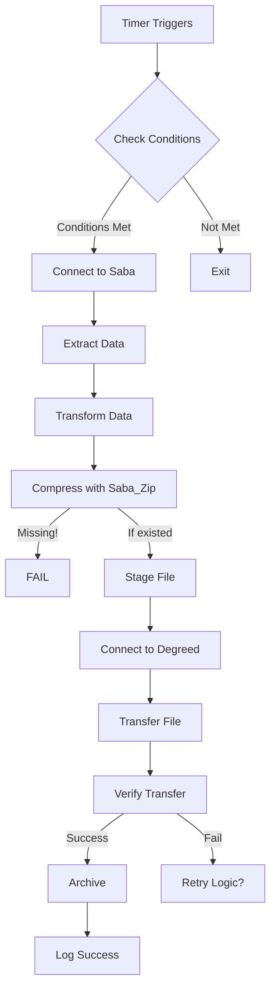

# GlobalScape Technical Analysis: Saba → Degreed Integration

**Document Created**: March 3, 2026  
**Based On**: Saba.json analysis and current system implementation  
**Status**: Technical documentation of existing implementation

---

## Executive Summary

The current integration uses **GlobalScape MFT (Managed File Transfer)** - now known as **Fortra's GoAnywhere MFT** - to orchestrate data transfers between Saba LMS, Degreed, and other systems. The system utilizes 9 timer-based event rules to handle various data synchronization tasks.

⚠️ **Critical Finding**: All 9 event rules are currently marked as **invalid** due to a missing custom command: `Saba_Zip`

---

## What is GlobalScape/GoAnywhere MFT?

**GlobalScape MFT** (now **GoAnywhere MFT** by Fortra) is an enterprise-grade managed file transfer solution that provides:

- **Automated file transfers** between systems using various protocols (SFTP, FTPS, HTTP/S, etc.)
- **Event-driven workflows** triggered by timers, file arrivals, or other events
- **Data transformation** capabilities (encryption, compression, format conversion)
- **Connection profiles** for secure authentication to remote systems
- **Audit logging** and compliance features
- **Custom commands** and PowerShell integration for extended functionality

### Key Concepts

| Concept | Description |
|---------|-------------|
| **Event Rule** | A workflow that executes when triggered (timer, file event, etc.) |
| **Timer Trigger** | Scheduled execution at specific times/intervals |
| **Connection Profile** | Reusable connection configuration for remote systems |
| **Custom Command** | User-defined scripts (PowerShell, Bash, etc.) that extend MFT functionality |
| **Statement** | Individual action or condition within an event rule |

---

## Current Implementation Architecture

### System Components

```
┌─────────────┐
│   Saba LMS  │ (Source: HR, Training, Learning data)
└──────┬──────┘
       │
       ▼
┌──────────────────────────────────────────┐
│   GlobalScape/GoAnywhere MFT Platform     │
│                                           │
│  • Timer-based Event Rules (9 jobs)      │
│  • Connection Profiles (Saba, Degreed)   │
│  • Custom Commands (PowerShell)          │
│  • Data Processing & Transformation      │
└──────┬───────────────────┬───────────────┘
       │                   │
       ▼                   ▼
┌─────────────┐     ┌─────────────┐
│   Degreed   │     │    Vemo     │
│     LXP     │     │             │
└─────────────┘     └─────────────┘
```

---

## GlobalScape Event Rules (Jobs) Analysis

### Job Inventory

| # | Job Name | Purpose | Target System | Schedule | Status |
|---|----------|---------|---------------|----------|--------|
| 1 | `162_Saba_ChromeRiverData_Upload_Timer` | Chrome River expense training data → Saba | Saba | Daily (weekdays) | ⚠️ Invalid |
| 2 | `165_Saba_Photo_Upload_Timer` | Employee photos → Saba | Saba | Daily (weekdays) | ⚠️ Invalid |
| 3 | `167_Saba_Degreed_RL_Upload_Timer` | Required Learning data → Degreed | Degreed | Daily | ⚠️ Invalid |
| 4 | `167_Saba_Degreed_RL_Upload_Timer_ReRun` | Required Learning retry job | Degreed | Daily | ⚠️ Invalid |
| 5 | `168_Saba_Vemo_Upload_Timer` | Learning data → Vemo | Vemo | Weekly | ⚠️ Invalid |
| 6 | `170_Saba_Degreed_Content_Upload_Timer` | Content catalog → Degreed | Degreed | Daily (weekdays) | ⚠️ Invalid |
| 7 | `170_Saba_Degreed_Content_Upload_Timer_ReRun` | Content catalog retry job | Degreed | Daily (weekdays) | ⚠️ Invalid |
| 8 | `171_Saba_Degreed_Completion_Upload_Timer` | Course completions → Degreed | Degreed | Daily | ⚠️ Invalid |
| 9 | `171_Saba_Degreed_Completion_Upload_Timer_ReRun` | Completions retry job | Degreed | Daily | ⚠️ Invalid |

### Data Flow Patterns

#### Pattern 1: Saba → Degreed (Primary Integration)
- **Required Learning** (Jobs 167, 167_ReRun)
- **Content Catalog** (Jobs 170, 170_ReRun)
- **Course Completions** (Jobs 171, 171_ReRun)

#### Pattern 2: Inbound to Saba
- **Chrome River Training Data** (Job 162)
- **Employee Photos** (Job 165)

#### Pattern 3: Saba → Other Systems
- **Vemo Integration** (Job 168)

---

## Technical Deep Dive

### Job Configuration Details

#### Timer Schedules

| Job | Start Time (Unix) | Recurrence | Weekdays Only | End Time Enabled |
|-----|-------------------|------------|---------------|------------------|
| 162_ChromeRiver | 1504589400 | Daily | Yes | No |
| 165_Photo | 1500460200 | Daily | Yes | No |
| 167_RL | 1692855000 | Daily | No | No |
| 167_RL_ReRun | 1692856800 | Daily | No | No |
| 168_Vemo | 1663486200 | **Weekly** | Yes | No |
| 170_Content | 1663553700 | Daily | Yes | **Yes** |
| 170_Content_ReRun | 1663555500 | Daily | Yes | **Yes** |
| 171_Completion | 1663479900 | Daily | No | No |
| 171_Completion_ReRun | 1663481700 | Daily | No | No |

**Note**: Unix timestamps suggest jobs were created/modified between 2017-2022.

### Connection Profiles

The JSON reveals three connection profiles used across the jobs:

```json
{
  "Saba": "a5032b92-6c99-492c-895d-68538b4238ba",
  "Degreed": "f3fdc542-fae6-4386-b62a-8d8ac2336a6b",
  "Vemo": "d5a8ecc3-b5ef-4378-a659-4373a826e32a"
}
```

**Connection Profile Capabilities:**
- Stores authentication credentials (username/password, API keys, certificates)
- Defines connection endpoint (URL, hostname, port)
- Protocol configuration (SFTP, HTTPS, etc.)
- Timeout and retry settings

### Statement Structure

Each event rule contains a `StatementsList` with multiple statement types:

1. **Action Statements**: Execute operations (file copy, script execution, API calls)
2. **Condition Statements**: Logic gates using AND/OR operators
3. **Loop Dataset Statements**: Iterate over result sets

**Example Pattern** (from job analysis):
```
IF (Condition 1 OR Condition 2)
THEN
  Execute Action 1
  Execute Action 2
  IF (nested condition)
    Execute Action 3
```

---

## Critical Issues Identified

### 🔴 Issue #1: Missing Custom Command

**Error**: `"Event Rule is invalid: Command 'Saba_Zip' does not exist."`

**Impact**: 
- Affects all 9 event rules
- Jobs cannot execute successfully
- Data synchronization is likely failing

**Root Cause Analysis**:
- Custom command `Saba_Zip` (ID: `0b04bb0e-3f0d-55c6-a166-49bc658fb477`) is referenced but missing
- Only explicitly listed in Job 165 (Photo Upload) relationships
- Likely used for file compression before transfer

**Probable Original Functionality**:
```powershell
# Hypothetical Saba_Zip command
# Purpose: Compress files before SFTP transfer
Compress-Archive -Path $InputPath -DestinationPath $OutputPath
```

### 🟡 Issue #2: Retry Job Logic Gaps

**Current State**:
- Retry jobs (ReRun) are separate timer-based jobs
- No apparent file cleanup before retry
- No coordination between primary and retry jobs

**Problems**:
1. **Race conditions**: Primary and retry jobs could overlap
2. **File duplication**: Multiple files in target folder
3. **Unclear pickup logic**: Degreed may pick up wrong file if multiple exist
4. **No pre-retry validation**: Missing folder check as noted in requirements

### 🟡 Issue #3: Timer Sequencing

**Observed**: Jobs have "Next" relationships suggesting execution order:
```
162 → 165 → 168 → 170 → 171 → 171_ReRun → ...
```

**Concern**: 
- Dependent jobs may execute before previous job completes
- No visible error handling between chained jobs
- Failure propagation unclear

### 🟠 Issue #4: Data Flow Visibility

**Gap**: JSON shows structure but not actual data operations:
- What API endpoints are called?
- What file formats are transferred? (CSV, XML, JSON?)
- What data transformations occur?
- Where are files staged temporarily?

---

## Technology Stack & Skills Required

### Current Technologies

| Technology | Usage | Skill Level Needed |
|------------|-------|-------------------|
| **PowerShell** | Custom commands, file operations, data manipulation | Intermediate-Advanced |
| **GoAnywhere MFT** | Event rule design, workflow logic | Intermediate |
| **Saba LMS APIs** | Data extraction | Intermediate |
| **Degreed APIs** | Data ingestion | Intermediate |
| **SFTP/FTPS** | Secure file transfer protocols | Basic-Intermediate |
| **JSON/XML** | Data formats | Intermediate |
| **SQL** | Possible data queries (if database connections used) | Intermediate |
| **Windows Server** | Platform hosting GlobalScape | Basic-Intermediate |
| **Regex** | Data parsing/validation | Basic |

### PowerShell Components Likely Involved

Based on typical MFT integrations:

```powershell
# File operations
Get-ChildItem, Move-Item, Remove-Item, Test-Path

# Compression
Compress-Archive, Expand-Archive

# Data processing
Import-Csv, Export-Csv, ConvertTo-Json, ConvertFrom-Json

# API calls
Invoke-RestMethod, Invoke-WebRequest

# Error handling
Try-Catch-Finally, Write-Error, throw

# Logging
Write-Output, Add-Content (to log files)
```

---

## File System & Staging Areas

### Expected Folder Structure

Based on MFT best practices, likely structure:

```
\\FileServer\GlobalScape\
├── Saba\
│   ├── Incoming\          # Data from Saba
│   │   ├── ChromeRiver\
│   │   ├── Photos\
│   │   └── Exports\
│   └── Outgoing\          # Data to Saba
├── Degreed\
│   ├── Staging\           # Prepared files before transfer
│   │   ├── RequiredLearning\
│   │   ├── Content\
│   │   └── Completions\
│   ├── Archive\           # Successful transfers
│   └── Failed\            # Failed transfer attempts
├── Vemo\
│   └── Outgoing\
└── Logs\
    ├── EventRules\
    └── Errors\
```

**Critical Gap**: Unknown if staging folders are cleaned before retries

---

## Data Volumes & Timing

### Estimated Data Characteristics

| Data Type | Estimated Volume | Frequency | File Format (assumed) |
|-----------|------------------|-----------|----------------------|
| Chrome River Training | ~100-500 records/day | Daily | CSV or JSON |
| Employee Photos | ~10-50 photos/day | Daily | JPG/PNG (zipped) |
| Required Learning | ~500-2000 assignments | Daily | CSV or XML |
| Content Catalog | ~100-1000 items | Daily | CSV or JSON |
| Completions | ~200-1000 completions | Daily | CSV or JSON |
| Vemo Data | ~500-5000 records | Weekly | CSV |

**Note**: Actual volumes unknown; estimates based on typical enterprise LMS usage

---

## Execution Flow Analysis

### Typical Job Execution Pattern



**Current State**: Process fails at step F due to missing `Saba_Zip` command

---

## Security & Compliance Considerations

### Current Configuration Gaps

1. **Credential Storage**: Connection profiles contain credentials - rotation policy unknown
2. **Audit Logging**: GlobalScape provides logs, but retention and review process unclear
3. **Data Encryption**: 
   - In transit: SFTP/FTPS likely used ✓
   - At rest: Unknown for staging folders
4. **Access Control**: Who has permissions to modify event rules?
5. **PII Handling**: Employee photos and training records contain PII

### Compliance Requirements

Likely regulations affecting this integration:
- **GDPR**: If EU employees are in the system
- **SOX**: If training relates to financial controls (Chrome River)
- **Internal FM Global policies**: Data classification and handling

---

## Performance Metrics (Unknown)

**Questions to Answer**:
- Average execution time per job?
- Failure rate of primary jobs vs. retry jobs?
- Data transfer speeds?
- Queue depths during peak times?
- Resource utilization on GlobalScape server?

---

## Integration Points Detail

### Saba LMS Integration

**Assumed Capabilities**:
- REST API or SOAP API for data extraction
- Scheduled reports/exports
- SFTP server for file-based integration

**Data Extracted From Saba**:
- Employee profiles
- Course catalog
- Enrollment data
- Completion records
- Learning paths/required learning

### Degreed LXP Integration

**Assumed Capabilities**:
- REST API for data ingestion
- SFTP drop folder for bulk imports
- Webhook support for real-time updates (not used in current design)

**Data Sent To Degreed**:
- Learning assignments (required learning)
- Content metadata
- Completion events

### Chrome River Integration

**Assumed**:
- Data about training expenses submitted by employees
- Likely file-based export from Chrome River expense system
- GlobalScape picks up file and routes to Saba

---

## Monitoring & Alerting (Current State Unknown)

**Expected Capabilities** (if properly configured):
- Email notifications on job failure
- Dashboard showing job status
- Execution history and logs
- File transfer audit trail

**Gaps** (based on requirements discussion):
- No apparent automated alerts for recurring failures
- Manual intervention required for issue resolution
- Limited visibility into root causes

---

## Dependencies & Prerequisites

### Infrastructure Dependencies

1. **Network Connectivity**:
   - GlobalScape server → Saba LMS
   - GlobalScape server → Degreed APIs
   - GlobalScape server → File shares

2. **Service Accounts**:
   - Saba API account
   - Degreed API account
   - Windows service account for GlobalScape

3. **Firewall Rules**:
   - Outbound HTTPS (443) for API calls
   - SFTP ports (typically 22)

4. **DNS Resolution**:
   - Saba endpoints
   - Degreed endpoints

### Software Prerequisites

- **GlobalScape MFT Server**: Version unknown (critical for planning)
- **PowerShell**: Version 5.1+ (Windows Server default)
- **.NET Framework**: Required by GlobalScape (version TBD)
- **Windows Server**: OS hosting GlobalScape (version TBD)

---

## Configuration Management

### Current State (Assumed Issues)

❌ **Version Control**: JSON export exists, but is configuration in source control?  
❌ **Change Management**: Process for testing changes before production?  
❌ **Documentation**: This document is first technical documentation  
❌ **Backup/Recovery**: Event rule backup strategy?  
❌ **Environment Parity**: Is there a test/dev environment matching production?

### Best Practices Not Currently Followed

1. **Infrastructure as Code**: Event rules should be in Git
2. **Automated Testing**: No test suite for integration logic
3. **CI/CD Pipeline**: Manual deployments prone to error
4. **Configuration Validation**: No automated checks before deployment

---

## Appendix A: JSON Structure Reference

### Event Rule Top-Level Structure

```json
{
  "id": "unique-guid",
  "type": "eventRule",
  "attributes": {
    "info": { /* Job metadata */ },
    "statements": { /* Workflow logic */ },
    "trigger": { /* Timer configuration */ }
  },
  "relationships": {
    "ConnectionProfiles": [ /* System connections */ ],
    "CustomCommands": [ /* PowerShell scripts */ ],
    "EventRuleFolder": { /* Organization */ }
  }
}
```

### Timer Parameters Breakdown

| Parameter | Description | Example Values |
|-----------|-------------|----------------|
| `Recurrence` | How often job repeats | "Daily", "Weekly", "Monthly" |
| `StartDateTime` | Unix timestamp for first run | 1663479900 |
| `EveryWeekDay` | Run Mon-Fri only | true/false |
| `RepeatEnabled` | Run multiple times per day | true/false |
| `RepeatRate` | Interval if repeating | 1 (hour) |
| `HolidayCalendarID` | Skip holidays | GUID or null |

---

## Appendix B: Retry Job Pattern Analysis

### Current Retry Implementation

**Job Pairs with Retry Logic**:
1. `167_RL` + `167_RL_ReRun` (30-minute offset)
2. `170_Content` + `170_Content_ReRun` (30-minute offset)
3. `171_Completion` + `171_Completion_ReRun` (30-minute offset)

**Time Offsets**:
- Primary: 1663479900 (example)
- Retry: 1663481700 (30 minutes later)

**Missing Logic**:
- No conditional execution (retry runs even if primary succeeds)
- No file cleanup before retry
- No coordination mechanism
- No exponential backoff for multiple failures

---

## Appendix C: API Endpoints (To Be Documented)

**Saba API Endpoints** (assumed):
- `/api/v1/learning/completions`
- `/api/v1/catalog/content`
- `/api/v1/users/{userId}/assignments`

**Degreed API Endpoints** (assumed):
- `/api/v2/content`
- `/api/v2/completions`
- `/api/v2/required-learning`

**Status**: Actual endpoints need to be extracted from event rule action statements (omitted in summarized JSON)

---

## Next Steps for Analysis

1. ✅ Document event rule structure (completed in this document)
2. ⏳ Locate and analyze actual PowerShell scripts used in event rules
3. ⏳ Map data transformations occurring in each job
4. ⏳ Document API payloads and response handling
5. ⏳ Create sequence diagrams for each integration flow
6. ⏳ Identify all file system paths used
7. ⏳ Document error handling logic per job
8. ⏳ Interview original implementation team for tribal knowledge

---

**Document Status**: v1.0 - Initial analysis based on Saba.json  
**Needs Review By**: Vinod Reddy (Technical), John Tang (Business), Stephanie Rice (Architecture)
